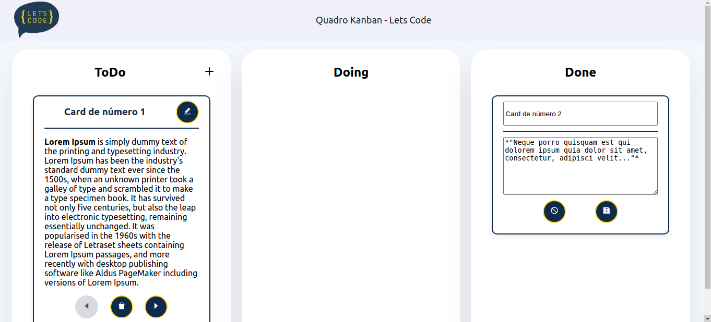

# Desafio Técnico Let's Code - Frontend - Izabela Melo

Link para descrição do desafio: https://gitlab.com/gabriel.militello1/desafio-tecnico-frontend

## Comandos importantes

1) Para instalar o ambiente:

```
cd front
yarn install
```

2) Para rodar o projeto:

```
yarn start
```

3) Para rodar os testes do projeto:

```
yarn test
```

4) Para rodar o lint do projeto:

```
yarn lint
```

## Decisões importantes do projeto

* Foi considerado como "uma única tela" = uma única rota. Por esse motivo, preferi fazer a feature de adicionar novo card com um modal
* Para permitir uma acessibilidade mínima, adicionei o FocusLock (https://www.npmjs.com/package/react-focus-lock). Isso faz com que o foco seja levado para o modal e que nada por baixo do modal consiga ficar em foco. Dessa forma, leitores de tela conseguirão passar o conteúdo corretamente.
* Os botões tem focus, hover e disabled com visualizações diferentes para permitir uma melhor acessibilidade. Os botões também possuem o aria-label, já que podem ser apenas ícones.
* Foi adicionado o react-icons
* Foi adicionado o eslint
* O código foi dividido entre components (componentes visuais que podem ser reutilizados), services (como se dá a comunicação com backend), domain (tipos que foram usados em todo o projeto), assets (imagens utilizadas) e test (pasta para testes)
* As telas estão responsivas

## Screenshots do resultado final
* Desktop




* Mobile


